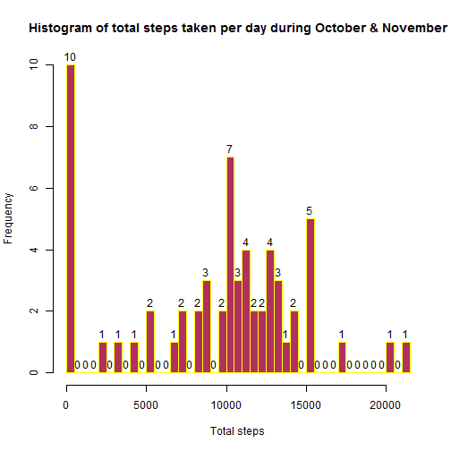
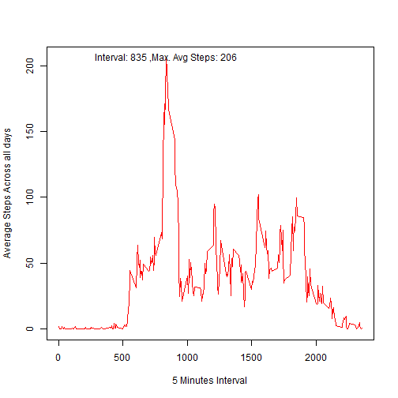
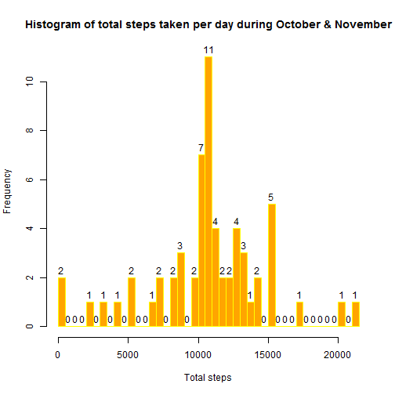
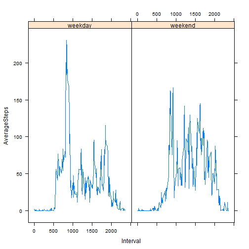

Assigment1: Reproducible Research
================================


Loading and preprocessing the data


```r
library(lattice)
# Set Working Directory and Read the source data
setwd("C:/Users/PrabhnoorJapman/Documents/Assignments/Reproducible Research/repdata_data_activity")
activitydata=read.csv("activity.csv")
```

## What is mean total number of steps taken per day?
#### Calculate Total Number of steps per day

```r
# Calculate Total Number of steps per day
sumSteps=aggregate(activitydata[,1],list(activitydata$date),sum,na.rm=TRUE)
sumSteps$Group.1=as.POSIXct(sumSteps$Group.1)
```


#### A histogram of the total number of steps taken each day

```r
#Histogram for total steps each day
hist(sumSteps$x,breaks=c(61),labels = TRUE,col="maroon",border = "yellow",xlab = "Total steps",main="Histogram of total steps taken per day during October & November")
```

 

####  Mean and Median of the total number of steps taken per day

```r
mean(sumSteps$x)
```

```
## [1] 9354.23
```

```r
median(sumSteps$x)
```

```
## [1] 10395
```

## What is the average daily activity pattern?

```r
sumStepsPerInterval=aggregate(activitydata[,c(0,1)],list(activitydata$interval),mean,na.rm=TRUE)

#rename the columns
names(sumStepsPerInterval)=c("Interval","AverageSteps")

#Create plot
plot(sumStepsPerInterval$AverageSteps~sumStepsPerInterval$Interval,type="l",col="red",xlab="5 Minutes Interval",ylab = "Average Steps Across all days")

#Get the Interval that has maximum steps recorded against it
maximumStepsInterval=sumStepsPerInterval[which(sumStepsPerInterval$AverageSteps==max(sumStepsPerInterval$AverageSteps)),1]

#Highlight the point that shows maximum steps and interval
text(maximumStepsInterval,max(sumStepsPerInterval$AverageSteps),paste("Interval:",maximumStepsInterval,",Max. Avg Steps:",round(max(sumStepsPerInterval$AverageSteps))))
```

 


## Imputing missing values


```r
# Step1: Get the total number of rows where there are missing values
paste("Total number of rows with missing values:",length(which(is.na(activitydata$steps))))
```

```
## [1] "Total number of rows with missing values: 2304"
```

#### Mean of steps per 5-minute interval for all days

```r
# Step2: Get the mean of steps per 5-minute interval for all days
meanStepsPerInterval4days=aggregate(activitydata[,c(0,1)],list(activitydata$interval),mean,na.rm=TRUE)
```

#### Create a new dataset from original and impute missing values

```r
# Step 3: Replace missing values in Steps column with the mean of steps per interval. Keeping non missing values as is
activitydataNoMissing=activitydata
for(i in 1:nrow(activitydataNoMissing))
{
  if(is.na(activitydataNoMissing[i,1]))
  {
  activitydataNoMissing[i,1]=meanStepsPerInterval4days[which(meanStepsPerInterval4days$Group.1==activitydataNoMissing[i,3]),2]
  }
}
```

#### Make a histogram of the total number of steps taken each day

```r
# Calculate Total Number of steps per day
sumStepsNoMissing=aggregate(activitydataNoMissing[,1],list(activitydataNoMissing$date),sum,na.rm=TRUE)
sumStepsNoMissing$Group.1=as.POSIXct(sumStepsNoMissing$Group.1)

#Histogram for total steps each day
hist(sumStepsNoMissing$x,breaks=c(61),labels = TRUE,col="orange",border = "yellow",xlab = "Total steps",main="Histogram of total steps taken per day during October & November")
```

 

#### Mean and median total number of steps taken per day

```r
#Calculate Mean and Median of steps taken per day
meanStepsNoMissingPerDay=mean(sumStepsNoMissing$x)
medianStepsNoMissingPerDay=median(sumStepsNoMissing$x)
```


```
## [1] "Mean of steps taken per day: 10766.1886792453"
```

```
## [1] "Median of steps taken per day: 10766.1886792453"
```

```
## [1] "Mean and Median are equal"
## [1] "Replacing missing vaules for Steps column with mean of steps for interval for all days has made distribution approximately symmetrical."
```

## Are there differences in activity patterns between weekdays and weekends?
#### Create a factor variable in the dataset with two levels - "weekday" and "weekend"

```r
activitydataNoMissing.f<-factor(activitydataNoMissing,levels = c("weekday","weekend"))
activitydataNoMissing$daytype=activitydataNoMissing.f
# Create a new column and fill the factor values based on if its a weekday or weekend
for(i in 1:nrow(activitydataNoMissing))
{
  if(weekdays.Date(as.Date(activitydataNoMissing[i,2]),abbreviate = FALSE) %in% c("Saturday", "Sunday"))
  {
    activitydataNoMissing[i,4]="weekend"
  }
  else
  {
    activitydataNoMissing[i,4]="weekday"
  }
}
```

#### Make a panel plot containing a time series plot (i.e. type = "l") of the 5-minute interval (x-axis) and the average number of steps taken, averaged across all weekday days or weekend days (y-axis).

```r
sumStepsPerIntervalNoMissing=aggregate(activitydataNoMissing[,c(0,1)],list(activitydataNoMissing$interval,activitydataNoMissing$daytype),mean,na.rm=TRUE)
names(sumStepsPerIntervalNoMissing)=c("Interval","DayType","AverageSteps")

par(mfrow=c(2,1))
par(mar = rep(2, 4))

xyplot(sumStepsPerIntervalNoMissing$AverageSteps~sumStepsPerIntervalNoMissing$Interval|sumStepsPerIntervalNoMissing$DayType,scales = list(y = list(relation = "same", alternating = TRUE)),layout = c(2, NA),xlab = "Interval",ylab = "AverageSteps",type="l")
```

 


